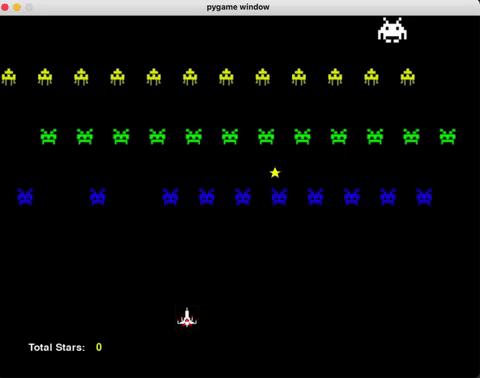

# space_invaders
A simplified Space Invaders clone made in Python.

## Features
Features of this Space Invaders Clone:
* Handling player movement and shooting
* Handling enemy movement and shooting
* Tracking user score
* Random shooting star generation for health restoration
* Tracking health and displaying it in a health bar

## To Play
Clone the repo and run the [main.py](https://github.com/JY2452/space-invaders/blob/master/main.py) file.

To save time, a demo gif is included at the top of this README file, demonstrating gameplay.
